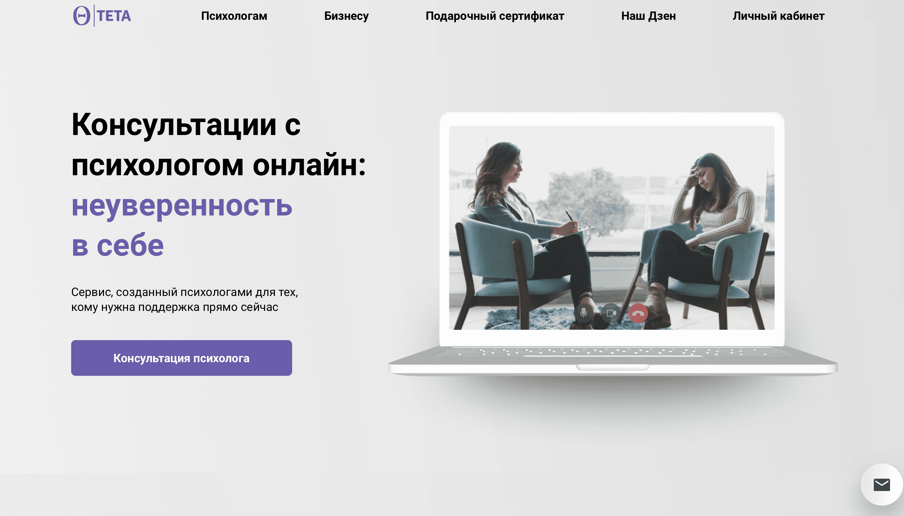

<h1 align="center">
    Приветствую всех, меня зовут 
    <a href="https://github.com/ilkor4" target="_blank">Корнелюк Илья</a>
    
</h1>

## Обо мне:

Занимаюсь разработкой сайтов различной сложности на React (Frontend-js-developer). Попробовал работать на фрилансе и понял, что это не мое. Поэтому сейчас на пути к своей мечте - устроиться в It-компанию на позицию junior-developer. Для этого я делаю
<a href="https://github.com/ilkor4/project-production">pet-проект</a> со всем современным стеком и, параллельно, решаю задачки на Codewars.

## Мои контакты:

## Мой стек:

  &nbsp
  &nbsp
  &nbsp
  &nbsp
  &nbsp
  &nbsp
  &nbsp
  &nbsp
  &nbsp
  &nbsp
  &nbsp
  &nbsp

## Портфолио:

  

    &nbsp;
    &nbsp;
    &nbsp;
  

  

    &nbsp;
    &nbsp;
    &nbsp;
  

  

    &nbsp;
    &nbsp;
    &nbsp;
  

## Деплои всех проектов:

### Коммерческие проекты:
- https://ilkor4.github.io/dinamo/
- https://teta.su
- https://aperturestudio.ru
- https://cakes-by-julia.ru
- https://07-05.ru/

### Pet проекты:
- https://github.com/ilkor4.github.io/chess/
- https://ilkor4.github.io/kuda-ya-poedy/
- https://ilkor4.github.io/russian-travel/
- https://github.com/ilkor4/react-mesto-api-full-gha
- https://ilkor4.github.io/aperture-studio/

### Дизайнерские проекты

https://disk.yandex.ru/d/CVUxJs_GE8Jy5g

### React + Node

https://ilkor4.github.io/movies-explorer-frontend/

##  GitHub stats

